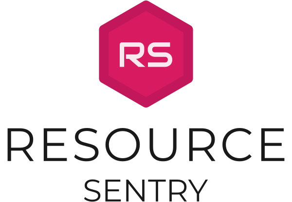

# 


Bring static resources (SCSS, JSON, XML, Property Files, etc.) to JavaScript.
The modular architecture where every static resource could be interpreted differently.

## Table of contents:

<!-- START doctoc generated TOC please keep comment here to allow auto update -->
<!-- DON'T EDIT THIS SECTION, INSTEAD RE-RUN doctoc TO UPDATE -->
 

- [Motivation](#motivation)
- [Configuration](#configuration)
  - [Config](#config)
  - [Settings](#settings)
- [Convention](#convention)

<!-- END doctoc generated TOC please keep comment here to allow auto update -->


## Motivation

Multi-language support? Project variables. Style variables. What if you want utilize power of namespaces in XML to build a collaborative source for multi-language support? What if you want to store style-related variables in SCSS, but you need to make some computation in runtime. Most of the data formats are not supported by browsers, - solution is to compile resources before code will be execute on user's machine and use "resources" as an efficient JavaScript code.

## Configuration

The main configuration is an Object. Configuration can be provided as a `rs.config.js` file.
Every configuration should include the root property `config` and optional `settings`.

Example: 

```js
module.exports = {config: {}, settings: {}};
```

### Config

Required. Determines about readers and writers.

- `input <Array>`, list of reader instances
- `output <Writer>`, instance of a writer

### Settings

Optional. Determines behavior of the tool.

- `watch <Boolean|Object>`, enables file watcher for reader inputs. Object could be used to provide `Chokidar` options.

## Convention

Custom readers and writers should use the same prefix.

- Reader: `rs-reader-xxx`. Example: `rs-reader-fast-xml`
- Writer: `rs-writer-xxx`. Example: `rs-writer-es3`
