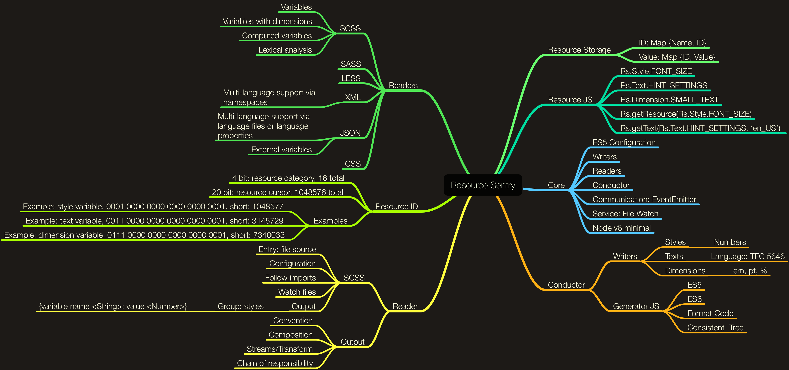

# 

Bring static resources (SCSS, JSON, XML) to JavaScript.


[](https://travis-ci.org/NicolasSiver/resource-sentry)
[](https://coveralls.io/github/NicolasSiver/resource-sentry?branch=master)


## Table of contents:

<!-- START doctoc generated TOC please keep comment here to allow auto update -->
<!-- DON'T EDIT THIS SECTION, INSTEAD RE-RUN doctoc TO UPDATE -->
 

- [Motivation](#motivation)
- [Readers](#readers)
  - [Properties](#properties)
  - [SCSS](#scss)
- [Writers](#writers)
  - [ES2015](#es2015)
- [Configuration](#configuration)
  - [Config](#config)
  - [Settings](#settings)
- [Architecture Ideas](#architecture-ideas)
- [Future Ideas (i.e TODO)](#future-ideas-ie-todo)

<!-- END doctoc generated TOC please keep comment here to allow auto update -->


## Motivation

Multi-language support? Project variables. Style variables. What if you want utilize power of namespaces in XML to build a collaborative source for multi-language support? What if you want to store style-related variables in SCSS, but you need to make some computation in runtime. Most of the data formats are not supported by browsers, - solution is to compile resources before code will be execute on user's machine and use "resources" as an efficient JavaScript code.

## Readers

### Properties

Extracts all values from the properties file. Ignores empty lines and comment lines (`#` and `!`).
Supports multi-line properties. Properties files are popular in Java world.

**Configuration**:

- `entry`, path to Properties file.

Example:

```
hello:world
easyCount = 8
```

Properties will be compiled into `rs.js` file ready for use in production code.

```js
import Rs from './rs';

Rs.getResource(Rs.Text.HELLO); // Return "world"
Rs.getResource(Rs.Value.EASY_COUNT); // Return 8
```

### SCSS

Extracts all variables from the provided `.scss` file.

Supports: `color`, `dimension`, `operation`, `text`, `simple value` and `variable` variables.

**Configuration**:

- `entry`, path to SCSS file.

Example:

```scss
$prf-value-one-hundred: 100;
$breakpoint: 768px;
$rhythm: 4px;
$padding-s: 2*$rhythm;
```

SCSS variables will be compiled into `rs.js` file ready for use in production code.

```js
import Rs from './rs';

Rs.getResource(Rs.Value.PRF_VALUE_ONE_HUNDRED); // Return 100
Rs.getResource(Rs.Dimension.BREAKPOINT); // Return 768
Rs.getResource(Rs.Dimension.RHYTHM); // Return 4
Rs.getResource(Rs.Dimension.PADDING_S); // Return 8
```

## Writers

### ES2015

Represents type categories as ES6 module with `Rs.getResource(Rs.Value.SOMETHING)` API.

**Configuration**:

- `path`, output directory for the final JavaScript `rs.js` file.

## Configuration

The main configuration is an Object. Configuration can be provided as a `rs.config.js` file.
Every configuration should include the root property `config` and optional `settings`.

Example: 

```js
module.exports = {config: {}, settings: {}};
```

### Config

Required. Determines about readers and writers.

- `input <Array>`, list of reader instances
- `output <Writer>`, instance of a writer

### Settings

Optional. Determines behavior of the tool.

- `watch <Boolean|Object>`, enables file watcher for reader inputs. Object could be used to provide `Chokidar` options.

## Architecture Ideas



## Future Ideas (i.e TODO)

- Reader: `gettext`, POT/PO files.
- Split Readers/Writers on separate repos and introduce a convention in naming for readers and writers.
